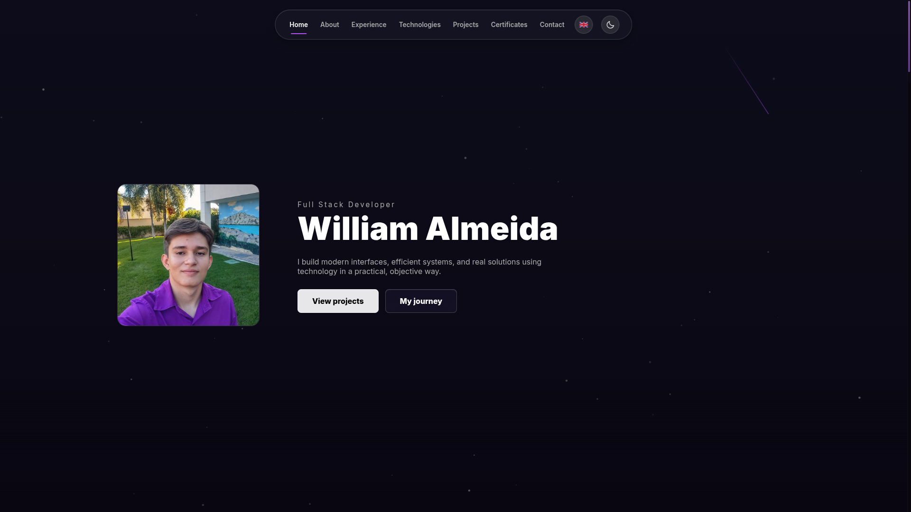

# William Almeida | Online Portfolio

<p align="center">
  <a href="https://williamalmeida.dev" target="_blank">
    &nbsp;
    &nbsp;
    &nbsp;
    &nbsp;
    &nbsp;
    
  </a>
</p>

<p align="center">
  <a href="https://williamalmeida.dev"><strong>https://williamalmeida.dev</strong></a>
</p>

---

## Preview

<!-- Replace demo.png with your actual file name in .github/assets/ -->
<p align="center">
  
</p>

---

## Overview

Personal portfolio of **William Almeida**, a full stack developer. The site presents my background, skills, projects, certifications, and contact channels. It features a modern, responsive, and interactive design, with a canvas background (particles and meteors), smooth animations, and polished UI details.

The current version is built with **React + Vite + TypeScript**, focusing on accessibility, performance, and user experience.

---

## Features

- **Hero** section with personal intro and quick links.
- **About** section with a mini-gallery of achievements.
- **Experience** timeline (professional and academic).
- **Technologies** section with interactive descriptions.
- **Projects** grid with images, descriptions, and links.
- **Certificates** showcase.
- **Contact** section with direct links (Email, GitHub, LinkedIn).
- **Animated canvas background** (particles + meteors).
- **Dynamic navbar** highlighting active section on scroll.
- **Custom purple glassmorphism scrollbar**.
- **Responsive layout** for desktop, tablet, and mobile.
- **Reduced motion support** for users who prefer less animation.

---

## Tech Stack

- **React** + **Vite** + **TypeScript**
- **CSS3** (custom animations, responsive grid, glassmorphism styling)
- **GSAP + ScrollTrigger** for scroll-based motion
- **Canvas 2D** for background effects
- **WebP** images for faster loading
- **Font**: Inter (Google Fonts)

---

## Getting Started

1. Clone the repository:

```bash
git clone https://github.com/williamalmeidadev/williamalmeidadev.github.io.git
```

2. Install dependencies:

```bash
npm install
```

3. Run locally:

```bash
npm run dev
```

4. Build for production:

```bash
npm run build
```
